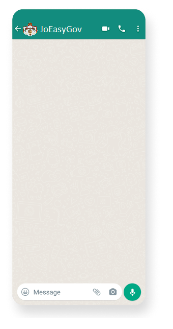
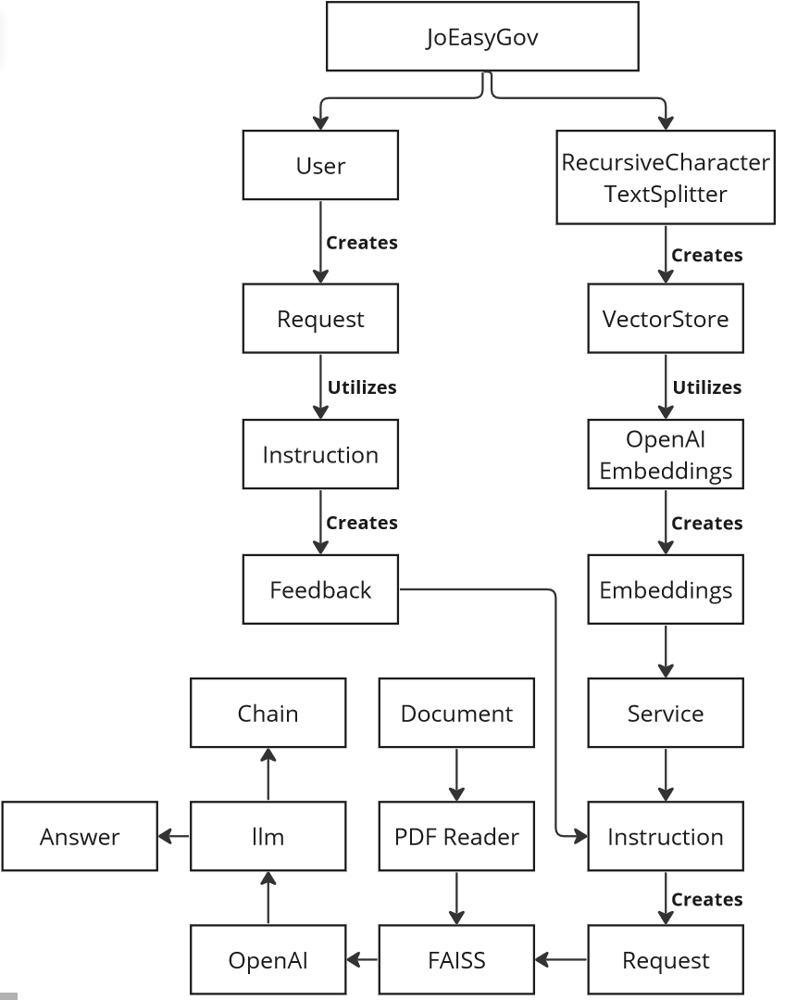

# Wireframes-and-Software-Requirements
# Wireframes
the wireframe is simply will be the whatsapp chat which will look like this:

# User Stories
### Title : Story one

- User Story sentence:
As a user, I want to reach the instructions for renewal my Passport so that I can quickly navigate to my account and do it .
- Feature Tasks : to scrape the Civil affairs at https://eservices.cspd.gov.jo/index-rtl.html
- Acceptance Tests : to return the correct information

### Title : Story two

- User Story sentence:
As a user, I want to reach the instructions for Renewal of Driver's License so that I can quickly navigate to my account and do it .
- Feature Tasks : to scrape this web site (https://www.ammancity.gov.jo/ar/eservices/login.aspx)
- Acceptance Tests : to return the correct information

### Title : Story Three

- User Story sentence:
As a user, I want to reach the E-Services that Civil Status and passports Department provided using voice Record so that I can quickly have the reponse.
- Feature Tasks : to reach the bot on the whatssaap platform 
- Acceptance Tests : to return the correct instructions

### Title : Story Four

- User Story sentence:
As a user, I want to reach the instructions to create a new Id  using voice Record so I can prepare them before  .
- Feature Tasks : send a voice note to the whatsaap, the function will convert the voive to text and do what the user wants 
- Acceptance Tests :  to return the correct instructions

### Title : Story Five

- User Story sentence:
As a user, I want to ..... using voice Record .
- Feature Tasks : send a voice note to the whatsaap, the function will convert the voive to text and do what the user wants 
- Acceptance Tests :  to return the correct instructions

### Estimate your User Stories

- extra small : 0-2 hours
- extra large : day or two

| story #       | estimation time |
|:-------------:|:---------------:|
|1|extra large|
|2|extra large|
|3|extra large|
|4|extra large|
|5|extra small|

# Software Requirements
### Vision
What is the vision of this product?

The vision of JoEasyGov is to revolutionize the way people interact with government transactions in Jordan by leveraging AI technology. The product aims to streamline and simplify the often complex and time-consuming process of dealing with governmental procedures. By providing a user-friendly and efficient platform, JoEasyGov envisions enhancing citizen experience, reducing bureaucracy, and promoting efficiency in government services. Ultimately, the goal is to empower individuals by offering accessible and personalized assistance, making government transactions more convenient and hassle-free.

What pain point does this project solve?

This project addresses the pain points associated with complex government procedures, lack of information, limited accessibility, and time-consuming processes in Jordan. JoEasyGov streamlines government transactions, simplifying the steps and providing clear guidance to users, thereby reducing confusion and frustration. It serves as a reliable source of accurate and up-to-date information, ensuring individuals have the necessary knowledge to make informed decisions. Additionally, JoEasyGov's 24/7 availability and electronic document submission feature eliminate the constraints of fixed working hours and physical visits, saving users time and effort.

Why should we care about your product?

You should care about JoEasyGov because it addresses the challenges and complexities individuals face when dealing with government transactions in Jordan. By streamlining processes, providing accessible information, and offering a user-friendly interface, JoEasyGov simplifies the entire experience. It saves time, reduces bureaucracy, and promotes efficiency, ultimately enhancing citizen satisfaction. With its 24/7 availability and round-the-clock access, JoEasyGov offers convenience to individuals, making government services more accessible to all.

### Scope (In/Out)
IN :

JoEasyGov is an AI-powered chatbot designed to simplify government transactions in Jordan. The product will offer a user-friendly interface, allowing users to interact naturally and comfortably through manual typing or voice commands. It will provide comprehensive transaction guidance, giving step-by-step instructions and real-time updates on the progress of applications. Users will have access to accurate and up-to-date information about government services, eligibility criteria, and application procedures. Additionally, JoEasyGov will enable convenient document submission electronically, eliminating the need for physical visits and paperwork.

OUT:

JoEasyGov will not provide legal advice or substitute for professional legal assistance. While it aims to provide accurate information about government services and policies, it will not offer personalized legal advice or interpretations of the law. Users should consult appropriate legal professionals for specific legal concerns or complex legal matters.
By clearly stating these limitations upfront, JoEasyGov can manage user expectations and ensure that users seek appropriate channels for financial transactions and legal advice, thereby avoiding any potential misunderstandings or liability issues.

### Minimum Viable Product vs
What will your MVP functionality be?

The MVP (Minimum Viable Product) functionality of JoEasyGov will focus on providing a user-friendly interface for users to interact with the chatbot. It will include the essential features such as transaction guidance, information access, document submission, and 24/7 availability. Users will be able to ask questions, seek guidance, and receive step-by-step instructions for different government transactions. They will also have access to accurate and up-to-date information about government services and policies. The MVP will aim to streamline processes, save time, and simplify the user's experience in dealing with government transactions in Jordan.

What are your stretch goals?

Our stretch goals for JoEasyGov include implementing voice command functionality to enhance user interaction and provide a more seamless experience. By incorporating voice commands, users can engage with the chatbot hands-free, further increasing convenience and accessibility. Additionally, we aim to integrate the app with popular messaging platforms like WhatsApp, allowing users to interact with JoEasyGov through their preferred communication channel. Another stretch goal is to enhance the natural language processing capabilities of the chatbot to improve its understanding of user queries and provide more accurate and personalized responses. These goals aim to further optimize user experience and make JoEasyGov a comprehensive and efficient government transaction assistant.

### Stretch
What stretch goals are you going to aim for?
In addition to the core features mentioned, JoEasyGov could aim for several stretch goals to further enhance its functionality and user experience. These stretch goals could include:

1. Voice Command Integration: Implementing voice command capabilities would allow users to interact with JoEasyGov using their voice, providing a more convenient and hands-free experience. This feature would require advanced speech recognition and natural language processing technologies.

2. Integration with Multiple Platforms: Expanding JoEasyGov's accessibility by integrating it with popular messaging platforms like WhatsApp, Telegram, or Facebook Messenger would enable users to engage with the chatbot through their preferred channels, reaching a wider user base.

3. Advanced AI Capabilities: Incorporating advanced AI capabilities such as sentiment analysis and context-aware responses could enhance JoEasyGov's understanding of users' needs and emotions, enabling it to provide more personalized and empathetic assistance.

4. Integration with Government Databases: Establishing integrations with government databases would allow JoEasyGov to access real-time data on government services, policies, and regulations. This integration would ensure that the information provided to users is always up to date and accurate.

By aiming for these stretch goals, JoEasyGov can continue to evolve and provide an even more sophisticated and comprehensive solution for simplifying government transactions in Jordan.

### Functional Requirements
The functionality of JoEasyGov includes:
1. User-friendly Interface: JoEasyGov provides a seamless chat-based interface that allows users to interact naturally and comfortably. It uses conversational AI technology to respond to user queries and provide step-by-step guidance for government transactions.
2. Transaction Guidance: JoEasyGov offers comprehensive guidance for various government transactions, helping users understand the required documents, procedures, and timelines. It provides real-time updates on application progress and notifies users about any additional requirements.
3. Information Access: JoEasyGov serves as a reliable source of information, offering detailed explanations of government services, eligibility criteria, and policies. It ensures users have access to accurate and up-to-date information, empowering them to make informed decisions.
4. Document Submission: JoEasyGov enables users to conveniently submit required documents and forms electronically. The chatbot guides users on formatting, sizes, and specifications, reducing the need for physical visits and paperwork.

### Data Flow
The flow of data in the JoEasyGov application involves the user interacting with the chatbot interface, providing input and receiving guidance. The chatbot processes user queries using the chat GPT API and langcgain library. It provides step-by-step instructions, handles document submissions electronically with the pypdf2 library, and offers real-time updates and information about government services. The user can access the app 24/7 and concludes their interaction when they have completed their transaction or obtained the necessary information.

### Non-Functional Requirements
Two non-functional requirements of the JoEasyGov application could be reliability and scalability. 

Reliability: The application should be reliable in terms of its availability and performance. This means that JoEasyGov should be able to handle user requests and transactions consistently without downtime or crashes. It should be designed to handle a large volume of concurrent users and ensure that the chatbot functions smoothly, providing accurate and timely responses.

Scalability: The application should be scalable to accommodate the potential growth in user base and increasing demands. As more individuals start using JoEasyGov, the system should be able to handle the increased load without compromising performance. This requires a robust architecture that can dynamically allocate resources and scale up or down as needed to ensure optimal performance and responsiveness.

# Domain Modeling

### Entities:

1. PdfReader: Represents a PDF reader object.
2. RecursiveCharacterTextSplitter: Represents a text splitter object that divides the text into chunks.
3. VectorStore: Represents a vector store for embeddings.
4. OpenAIEmbeddings: Represents embeddings generated using OpenAI.
5. FAISS: Represents a vector store implementation using FAISS.
6. llm: Represents an instance of the OpenAI language model.
7. Chain: Represents a question-answering chain.

### Relationships:

- PdfReader is associated with the uploaded PDF file.
- RecursiveCharacterTextSplitter splits the text extracted from the PDF into chunks.
- VectorStore is created from the chunks of text.
- OpenAIEmbeddings generates embeddings for the chunks of text.
- FAISS utilizes the embeddings to create the VectorStore.
- llm is an instance of the OpenAI language model used for question-answering.
- Chain is created using the llm instance for question-answering.

### Domain Model Diagram

1. Request: Represents a user's request for a particular government service. It may have properties like request ID, user ID, and service ID.
2. Service: Represents a government service
3. Instruction: Represents the instructions provided to the user for completing a task related to a government service. like instruction ID, service ID, step description, and additional resources.
4. Feedback: Represents the user follow up information

finally we dont need to Use a Database.
